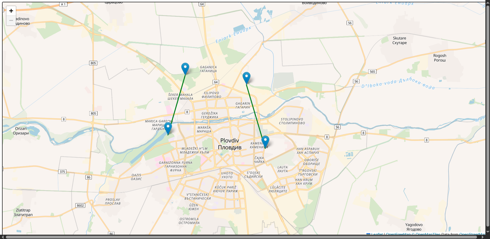

# Cyber Trespasser

**"Connect the dots!"**



---

## Why

People think that they have freedom of movement to the highest extent possible. They can travel by cars to places. But what they don't realize is that they are restricted to the road network which in turn is constrained by the puzzle of private property and state planning.

Cyber Trespasser is for adventurers who step off the beaten track. It is for hikers, cyclists and runners who often go where no one else goes and seek the ultimate freedom.

---

## What

- **Give trespassing access across your land and get access to a global network of trespassing routes**
- **Go further, go far by creating new routes beyond state road network**
- **Meet and socialize with people in the network as you trespass their properties**
- **Make travelling safer by forming trust and making properties accessible for walking, running and cycling**

---

## How

- **Create a route which trespasses your property**
- **When 3 people have used it and verified it's okay your route gets verified**
- **You get access to the global Cyber Trespass route network**
- **Fill in more routes as you travel and make the globe a trespassable network for humans**

## Installation

The app runs on the public IPFS network. In order to use it follow the steps below:

1. Install Linux
2. Install IPFS Companion http://docs.ipfs.io/install/ipfs-companion/
3. Install golang 1.20 or later version - https://go.dev/doc/install
4.  Clone https://github.com/stateless-minds/kubo to your local machine
`git clone https://github.com/stateless-minds/kubo.git`
5. Build IPFS
`make build`
6. Init IPFS
`./cmd/ipfs/ipfs init`
7.  Follow the instructions here to open your config file: https://github.com/ipfs/kubo/blob/master/docs/config.md. Usually it's `~/.ipfs/config` on Linux. Add the following snippet to the `HTTPHeaders`:
```
  "API": {
    "HTTPHeaders": {
      "Access-Control-Allow-Origin": ["webui://-", "http://k51qzi5uqu5dju2ed9i50vr5jqwccoysn63sjz0scnhbid5mxuww25x2g2hs7b.ipns.localhost:8080", "http://127.0.0.1:5001", "https://webui.ipfs.io"],
      "Access-Control-Allow-Credentials": ["true"],
      "Access-Control-Allow-Methods": ["PUT", "POST"]
    }
  },
 ```
8. Run the daemon:
+ `.cmd/ipfs/ipfs daemon --enable-pubsub-experiment`

9.  Navigate to <a href="https://ipfs.io/ipns/k51qzi5uqu5dju2ed9i50vr5jqwccoysn63sjz0scnhbid5mxuww25x2g2hs7b">Cyber Trespass</a>
10.  Pin it to your local node so that you cohost it every time your IPFS daemon is running
```
10.1. Open your IPFS dashboard

http://127.0.0.1:5001/webui

10.1 In your CLI with a running daemon run:

./cmd/ipfs/ipfs name resolve k51qzi5uqu5dju2ed9i50vr5jqwccoysn63sjz0scnhbid5mxuww25x2g2hs7b

Expected result for example:
/ipfs/QmNbHpS14eqByh2cWfZTA9ywAdwPE9nKpyTFodftPsS6AP

10.2. In the search bar of the web UI search for QmHash by pasting: QmNbHpS14eqByh2cWfZTA9ywAdwPE9nKpyTFodftPsS6AP
10.3 Click on More
10.4 Click Set Pinning
10.5 Mark local node and hit Apply
```

## FAQ

**1. How is it ensured one actually owns the property?**
 - If 3 people successfully transpassed and verify they didn't have any problems we take it as a guarantee.

**2. How is illegal trespassing prevented?**
 - Cyber Trespasser is not accountable for any illegal activities. Trespassing private property without mutual agreement is at one's own risk as usual.